# Lab 1: Custom allocator

## **Data structure**
 
Custom allocator consist of blocks. Every block has

- header
- data

Header occupies 5 byte, where first byte is availability of current block
and other for size of current block.

 

## **Implementation**
 

Custom allocator implement next **functions**:

- allocate memory
- reallocate memory
- free memory

 

#### **Initial allocator state**
 

Firstly allocate the specified amount of memory and create only first block
and place pointer on start of memory area - *startPtr*. Set *isAvailable* - true,
and *dataSize* - *(amount memory - size of header)*
 
 

*Picture 1. Initial allocator state*
 

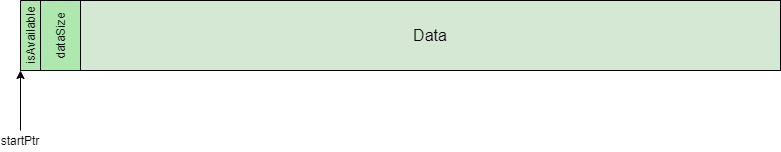
 
 

#### **Allocate memory**
 

Implementation this function in program -  __void* mem_alloc(size_t size)__, where *size* - 
size - which needed. This function will *return address* if there is free block with needed 
size or will *return NULL* if there isn't free blocks.

When we allocate memory we find first free block and check that this block size is more than
size, which need for user. If block size is less than we need we go to next block and find
suitable block.

When we find block, we divide this block by 2 blocks
 

- First block we notice that it is not available - *isAvailable = false* and 
using function for calculating dataSize with adjustment on 4 bytes, and set this value 
*dataSize*.

- Second block we notice that it is available - *isAvailable =true* and *dataSize* set 
value initial block size subtract need size
 
 

*Picture 2. Allocate memory*
 

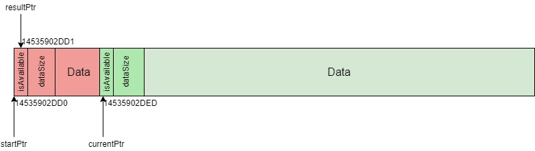
 
 

#### **Free memory**

Implementation this function in program - __void mem_free(void* addr)__, where *addr* - is a 
pointer, which note on start of need block.

Firstly, we find need block.
 
 

_Picture 3. Find needed block by addr_
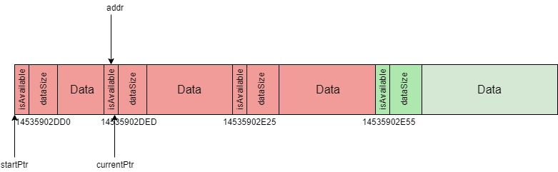
 
 

If we find it, we will notice this block available (*isAvailable = true*), else exit.
 
 

*Picture 4. Free block*
 

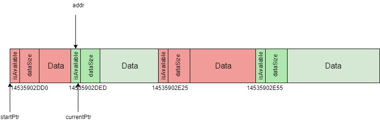
 
 

Then we check blocks, is there are some free block **_one by one_** we merge these blocks
 
 

*Picture 5.Sequence of free blocks*
 

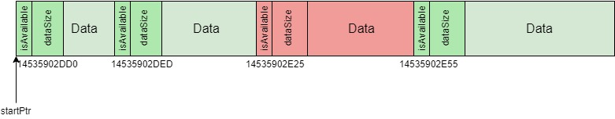
 
 

*Picture 6.Merging free blocks*
 

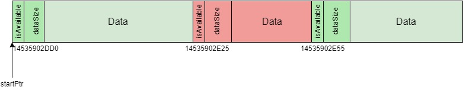
 
 

#### **Reallocate memory**
Implementation this function in program - __void* mem_realloc(void* addr, size_t size)__, 
where *addr* - is a pointer, which note on start of need block and *size* - is a new size for 
block. This function *return start pointer of block* with changed size.

Firstly we find need block, secondly: 
* if size current block is less then new size, we will create new block, using function mem_alloc.
   
   - if mem_alloc return null we will leave old block
   - else we will free old block with function free_block

* else we divide current block by 2 blocks, where one with new size, and second block is available 
with rest size

At last we check sequence of free blocks.

**_For example_** change block with address *14535902DED*(start state such as on Picture 3)
 
 

*Picture 7. Reallocate bigger size*
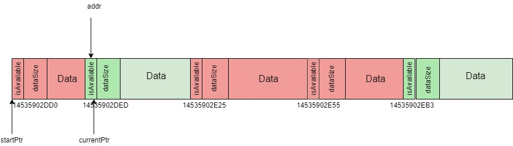
 
 

*Picture 8. Reallocate smaller size*
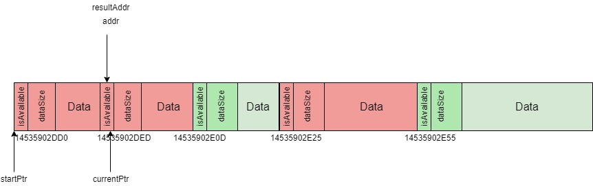
 
 

## Examples

*Picture 9.Allocate memory*

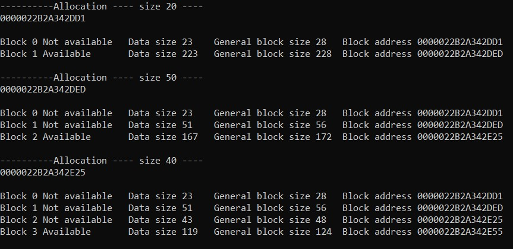

*Picture 10. Reallocate memory*

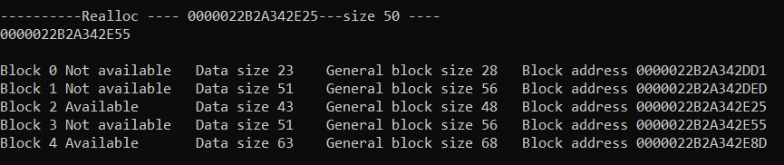

Picture 11. Free memory

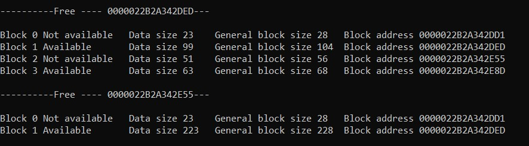

