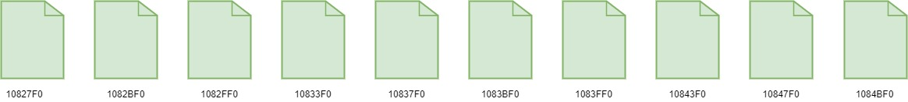
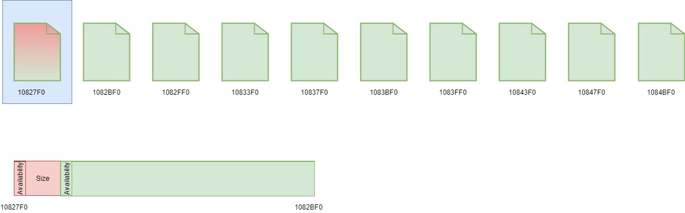
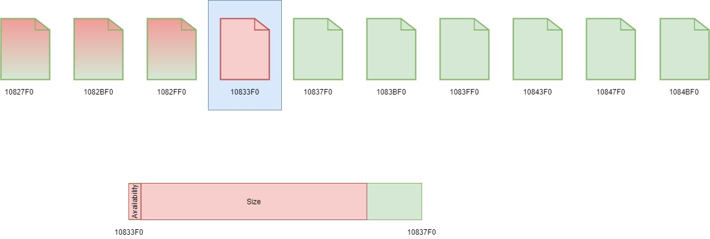
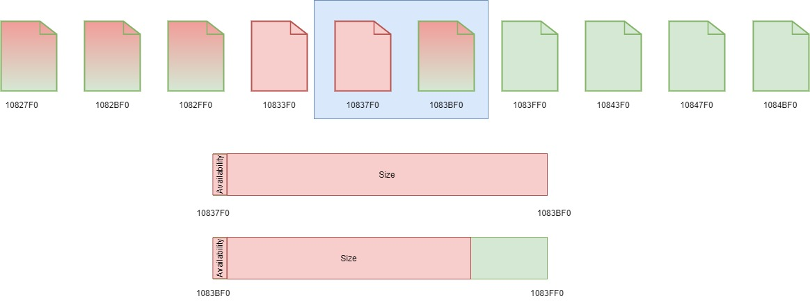
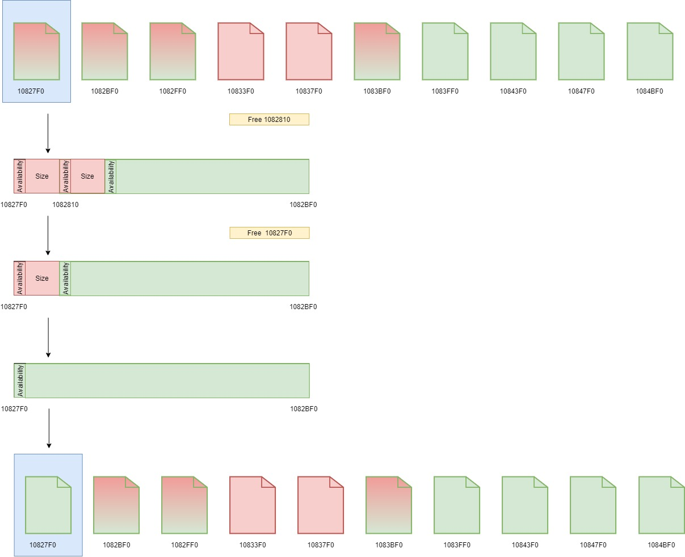
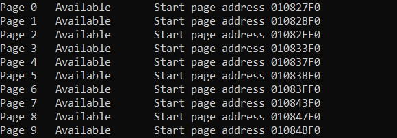
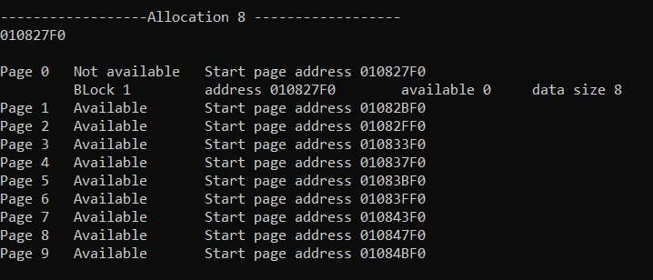
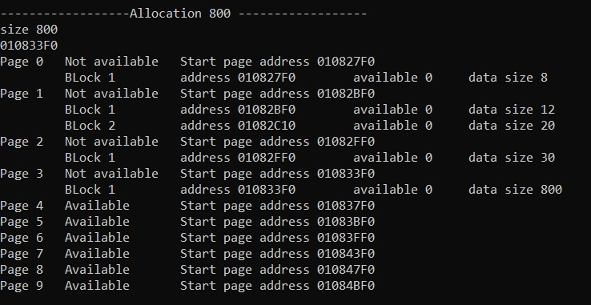
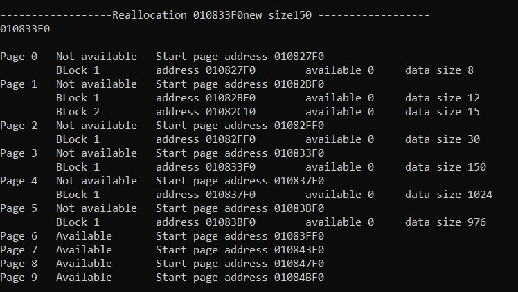
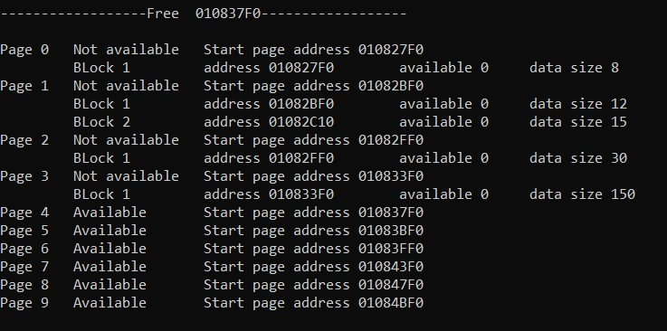

# Lab 2: Page custom allocator

## **Data structure**

 
Page custom allocator consist of pages. There are 3 state of page

- empty page
- page is occupied by blocks
- page is occupied by multipage block

Every block has
- header
- data

Header occupies 5 byte, where first byte is availability of current block
and other for size of current block.

Every page has own descriptor, which consist of

- first available block address
- page availability
- number free blocks

 

## **Implementation**
 

Page custom allocator implement next **functions**:

- allocate memory
- reallocate memory
- free memory

 

#### **Initial allocator state**
---
 

Firstly allocate the specified amount of memory, create only first block
and create page descriptor for each page. Set page descriptor's
*firstAvailableBlockPtr* - start page size, *availability* - true and
*dataSize* - *(PAGE_SIZE - HEADER_SIZE)*. All page descriptors create array - 
*pageDescriptors*
In this realization create 10 pages, where size of each of them is 1024 bytes.
 
 

*Picture 1. Initial allocator state*
 

 
 

### **Allocate memory**
---
 

Implementation this function in program -  __void* mem_alloc(size_t size)__, where *size* - 
size - which needed. This function will *return address* if there is free block with needed 
size or will *return NULL* if there isn't free page.

When we allocate memory we have 2 variants:
1. When *size* is less then half *PAGE_SIZE*
2. When *size* is more then half *PAGE_SIZE*

 
 

#### **Allocate block on one page**

 

We divide page on blocks, when *size* is less then half *PAGE_SIZE*.
Every page has blocks with the same size, where size 2x (x>=4)

we find occupied pages where blocks has the same size, which we need.
- **If** we find such page, then we get block address with *firstAvailableBlockPtr* and then set header 
block: *availability* - false, *data size* - size . And in page descriptor set 
*firstAvailableBlockPtr* - next block, *numberFreeBlocks* - minus one. 
- **Else** we find first available page. Set page descriptor *availability* - false,
calculate *numberFreeBlocks* - *(PAGE_SIZE/size)*. And write new block in this page as in previous 
paragraph.

*Picture 2. Allocate block on page*
 

 
 

#### **Allocate pages**

We allocate whole page, when *size* is more then half *PAGE_SIZE* and less then *PAGE_SIZE*.
In this case firstly find empty page, and the second set *firstAvailableBlockPtr* - the last byte page,
*availability* - false, and *numberFreeBlocks* - 0.

*Picture 3. Allocate only one block on page*
 

 
 

We allocate some pages, when *size* is more then *PAGE_SIZE*. In this case we find sequence 
of free pages and we write data here. We calculate full-size page and calculate size for page with 
rest of size. *For example* if we want to allocate 2000 bytes of memory we need one full-size page, 
and one page with 976 bytes. In case, when rest size is less then half *PAGE_SIZE* we allocate whole 
page anyway.

*Picture 4. Allocate on some pages*
 

 
 

#### **Free memory**
---
 

Implementation this function in program - __void mem_free(void* addr)__, where *addr* - is a 
pointer, which note on start of need block.

Firstly, we find need page and its type
 
 

If we find it, we will notice this block available (*isAvailable = true*), else exit.
- **If** finded page is page with blocks, we set this block header as free, and adding one block to
*numberFreeBlocks* and check if all blocks are empty set page descriptor *availability* - true, and
*firstAvailableBlockPtr* - on start page.

*Picture 5. Free block*
 

 
 

- **Else if** size less then *PAGE_SIZE*. Set header block as empty and page descriptor 
*availability* - true.

- **Else** size is more then *PAGE_SIZE* we mark empty full-size page and page with rest size.

 
 

#### **Reallocate memory**
---
 

Implementation this function in program - __void* mem_realloc(void* addr, size_t size)__, 
where *addr* - is a pointer, which note on start of need block and *size* - is a new size for 
block. This function *return start pointer of block* with changed size.

Firstly we find need page, secondly: 
* if it is page with blocks and size current block is less then new size, we will create new block,
using function mem_alloc.
   - if mem_alloc return null we will leave old block
   - else we will free old block with function free_block

* else if it only one page block or multipage block we free memory and allocate new piece of memory.

*Picture 6. Reallocate to smaller size *

 
 

## Examples

*Picture 7.Initial state*

*Picture 7.Allocate block*

*Picture 8.Allocate one page*

*Picture 9.Allocate some pages*

*Picture 10. Reallocate memory*

Picture 11. Free memory

