# Lab 3: Multilevel Feedback Queue Sheduling(MFQS)

## General description of algorithm 

Initially we have three empty queues with different time quantums.

- *zero queue* - 8ms
- *first queue* - 16ms
- *second queue* - without determined time quantum 

*Picture 1. General schema of multilevel queue sheduling*

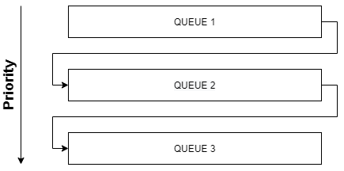

1. When *request* is came, it is added in *zero queue*. 

    *Picture 2. Adding new request*

    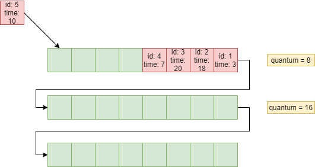

2. Take first *request* from *zero queue* and start to process it.
    + **If** *request* from *zero* queue is processed in *time quantum - 8ms*, we can consider that it is completed.
    + **Else if** *request* isn't completed in determined time quantum, *request* would add in *first queue*
3. Process all *requests* from *zero queue* as it describe in step 2.

    *Picture 3. After executing processes from zero queue*

    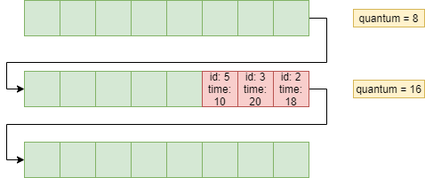

4. **When** *zero queue* is empty, start to execute *request* from *first queue*. **But** after every completed process in *first queue*, need check *zero queue* for adding new *requests*.
     + **If** *request* from *first* queue is processed in *time quantum - 16ms*, we can consider that it is completed.
    + **Else if** *request* isn't completed in determined time quantum, *request* would add in *second queue*
5. Process all *requests* from *first queue* as it describe in step 4, and check previous queue.

    *Picture 4. After executing processes from first queue*

    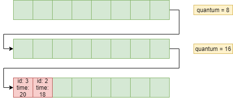

    *NOTE: If during executing request from first queue, in zero queue was added new request, we must return to requests in zero queue.*

6. **When** *zero and first queue* are empty, start to execute *request* from *second queue*. **But** after every completed process in *second queue*, need check *zero and first queue* for adding new *requests*.
Every *request* from *second* queue is processed for need time.

7. Process all *requests* from *second queue* as it describe in step 6, and check previous queues.

     *NOTE: If during executing request from second queue, in zero queue was added new request, we must return to requests in zero queue. And then if needed check first queue also.*

    According to *Picture 3.* All requests will be completed and all queues will be empty after step 5.

*Picture 5* is an example, when we have *requests* in both queues *zero* and *first*, but we can't start executing requests in *first queue*, because *zero queue* is not empty.

*Picture 5. During executing processes in zero queue*

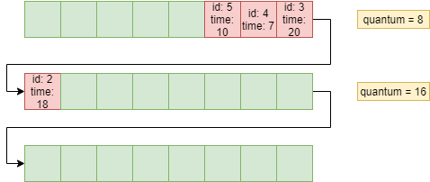

## Examples
---

*Picture 6. Initial state of queues*

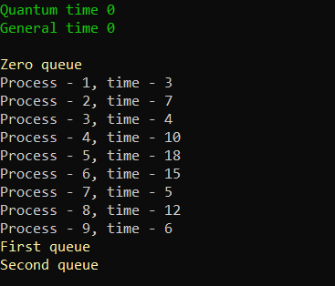

*Picture 7. Execute processes from zero queue*

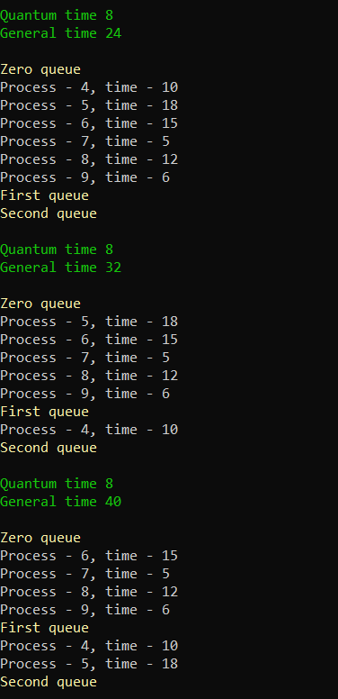

*Picture 8. Execute processes from first queue*

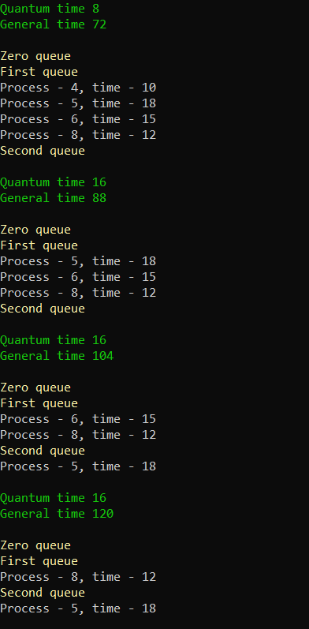

*Picture 9. Execute processes from second queue*

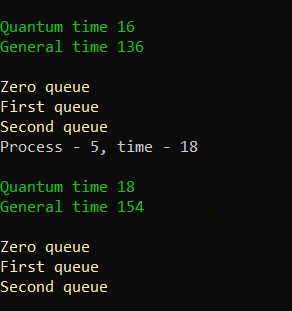

## Graphs 
---

*Pictute 10. Graph of average time on different intensity*

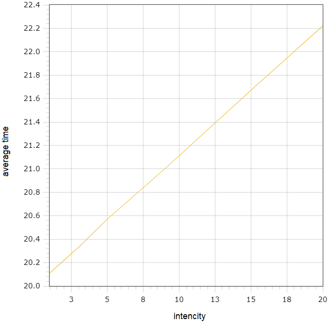

*Picture 11. Graph of downtime percent on different intensity*

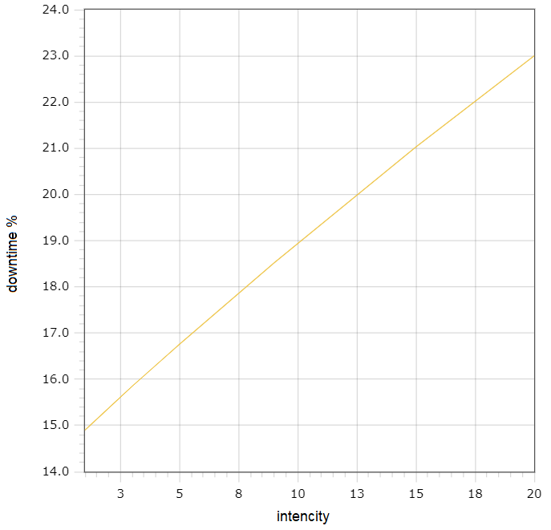