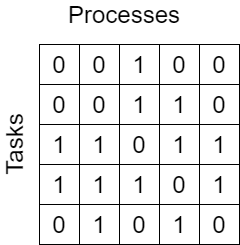
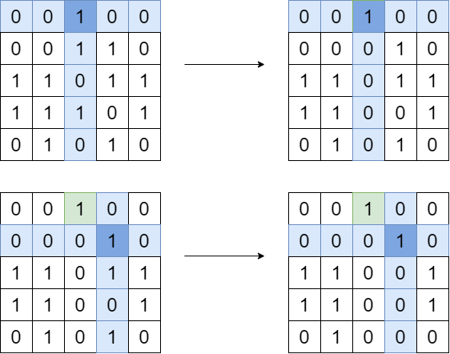
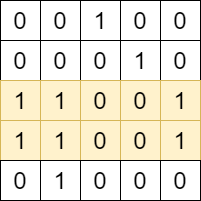
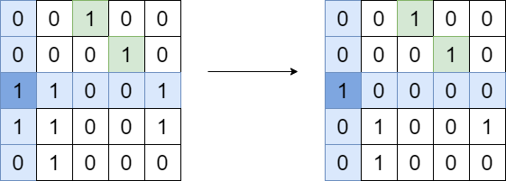
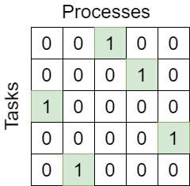
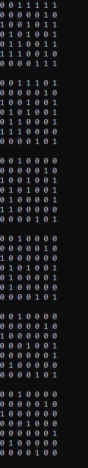
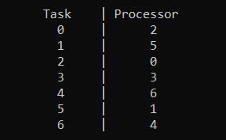

# Lab 4: Planning

**Formulation of the problem:** we have *N* processes and *M* tasks. We need distribute tasks on processes. So we need find maximum pairing

## General description of algorithm

We use 2 main theorem for solving our problem.

**Theorem 1**

Any vertex of unweighted bipartite graph, which has grade = 1, participate in one variant of maximum pairing.

**Theorem 2**

If in matrix we have fan, any vertex of van participate in one variant of maximum pairing.

According to algorithm after using theorem 2, we must reduction graph and work with creating sugraph. But for better demonstrating our action we will reset appropriate row and column.

Initial state:
    

1. Check existing maximum pairing. Sum in every row and must be 0 or 1.
    - if we find maximum pairing, we will finish our work.
2. Find all row which satisfy theorem 1. Another words, find row when we have ony one 1.
    - if we find such row, we need reset appropriate column(reduct graph), and not check this row later.

    
3. Find widest row(fan) in matrix. If there are some widest row, will give the first of them.

    

4. Choose anyone vertex of row and reset according row and column(reduct graph). In this realization I choose first vertex in row.

    

5. Go to *step 1*.

    Result 

    

## Examples

Results

